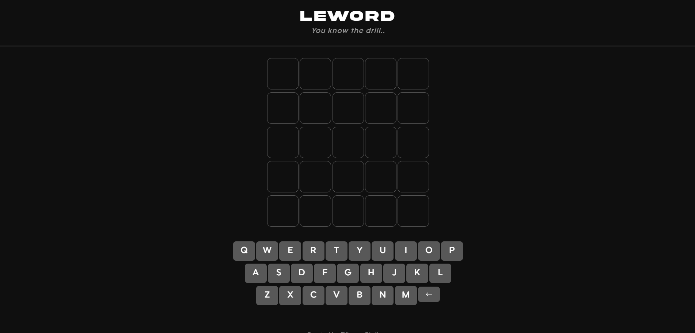
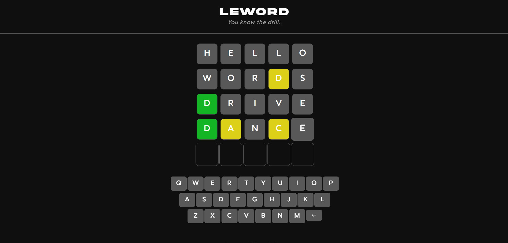

# Wordle Clone App

A **faithful recreation** of the popular word-guessing game, built from the ground up to mirror the **addictive gameplay** and **clean design** of the original. This clone preserves the **simple yet challenging** daily word puzzle experience while adding some personal customization options.

---

## 🛠️ Technologies Used

- **HTML5, CSS3, JavaScript**
- **Bootstrap 5** for responsive UI
- **VS Code** (development IDE)

---

## 📄 License

This project is open-source.

---

## 🤝 Contributing

Pull requests are welcome! Please follow standard GitHub flow and keep the code clean and documented.

---

## 📬 Contact

For questions, contact me at [obrizanou@gmail.com](mailto:obrizanou@gmail.com) or open an issue.
