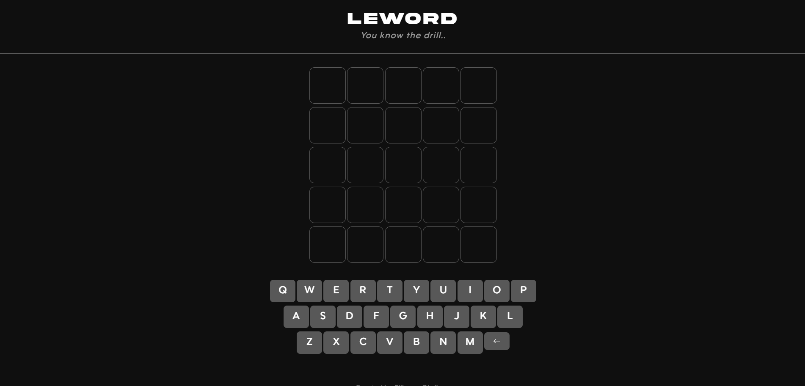
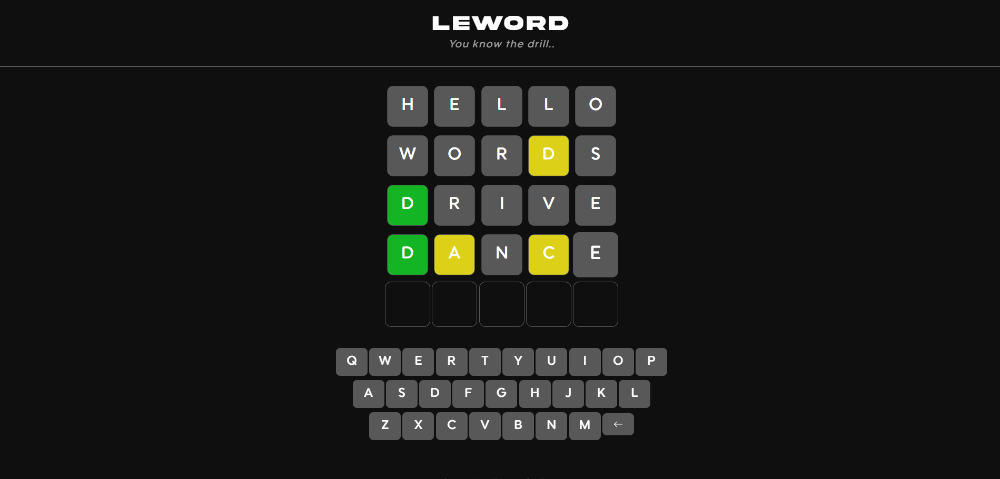

<h1 align="center">Wordle Clone</h1>
<h3 align="center">Faithful Implementation of the Iconic Word-Guessing Logic</h3>

<p align="center">
  A highly optimized recreation of the popular word-guessing game.
</p>

<p align="center">
  <a href="https://wordle-clone-appp.netlify.app/">
    
  </a>
  <a href="https://opensource.org/licenses/MIT">
    
  </a>
</p>

---

### Tech Stack

**Core View Engine & Computational Logic**
<p align="left">
  
  
</p>

**Design Layout & Interface Primitives**
<p align="left">
  
  
</p>

**Architecture Patterns & Architecture Subsystems**
<p align="left">
  
  
</p>

---

### Application Showcase

<p align="center">
  
  
</p>

---

### Getting Started (Local Development)

**1. Clone the repository:**
```bash
git clone [https://github.com/filipposobrijanu/Wordle-Clone.git](https://github.com/filipposobrijanu/Wordle-Clone.git)
cd Wordle-Clone
